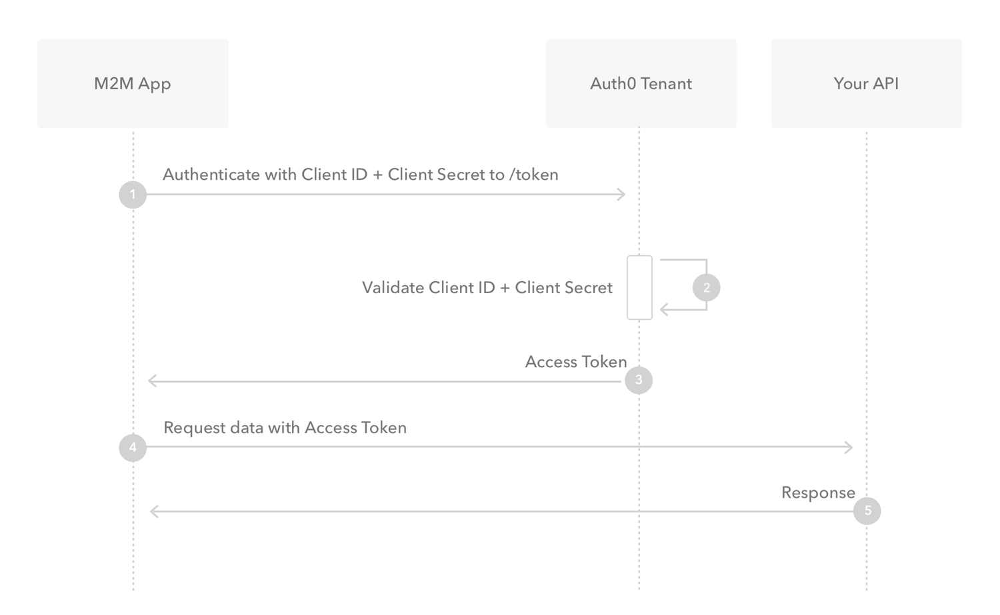

# Omelas Data API

Omelas offers programmatic API access to our proprietary database of curated content from social media and other publicly
available data sources. The API also provides access to descriptive and predictive analytics about the content and the users
producing that content. Contact Omelas at our [contact page](https://www.omelas.co/contact) for more information and access.

#### Versions

- Current version: v2019-04-15:
    - Includes endpoints:
        - content
        - entity
        - brand
        - portfolio
        - actor
        - story
        - campaigns
    

## Quickstart

Basic steps:
1. Get token from AuthO API using client_id and client_credentials (provided by Omelas)
1. Call API with token (as Bearer authorization)

Python code for calling the content endpoint:

```python
import http.client
import json

# Request Token
conn = http.client.HTTPSConnection("omelas.auth0.com")

payload = "{\"client_id\":\"CLIENT_ID\",\"client_secret\":\"CLIENT_SECRET\",\"audience\":\"omelas-user-auth-data-api\",\"grant_type\":\"client_credentials\"}"

headers = { 'content-type': "application/json" }

conn.request("POST", "/oauth/token", payload, headers)

# Extract token
res = conn.getresponse()
data = res.read()
data = data.decode("utf-8")
data_dict = json.loads(data)

access_token = data_dict['token_type'] + ' ' + data_dict['access_token']
headers = {'authorization': access_token}

# Call full content API with token
api_conn = http.client.HTTPSConnection("7wo9u54nd3.execute-api.us-gov-west-1.amazonaws.com")

# Use token to call API with desired parameters, potential calls are below as well as all the example queries for each endpoint

# Most recent content
api_conn.request('GET','/prod/v2019-04-15/content/vkontakte/', headers=headers)

# Single content ID
# api_conn.request('GET','/dev/v2019-04-15/content/vkontakte/CONTENT_ID', headers=headers)

# Single content ID
# api_conn.request('GET','/dev/v2019-04-15/location/twitter/LOCATION_ID', headers=headers)

# Note that timestamps need to be encoded as URLs, generally, this just means replacing spaces with %20.
# Timestamps are parsed with dateutil.parser.parse
# Specify content start time
# api_conn.request('GET','/dev/v2019-04-15/content/twitter/?most_recent_content_timestamp=TIMESTAMP', headers=headers)

# Process and decode response
api_res = api_conn.getresponse()
api_data = api_res.read()
api_data_string = api_data.decode('utf-8')
final_data_dict = json.loads(api_data_string)
```

## Resource endpoints

Omelas currently supports the following endpoints: 
- Content
  - Text from various sources eg. social media posts
- Entity
  - Metadata about a social media user or group
- Brand
 - Metadata about a brand, i.e. the crossplatform public facing name of accounts
- Portfolio
 - Metadata about a portfolio or network, i.e. a ministry, embassy, or media house with many brands
 - Actor
  - Metadata about a state, FTO, intergovernmental body, militia, or breakaway region
- Story
 - Summary data and id for aggregated stories
- Campaign
 - Summary data and id detected adversarial campaigns

### Content

This endpoint provides access to content objects either single item or a list of the most recent items.

Content endpoints are prefaced by /content and followed by the particular platform. For example: `/content/twitter` and `/content/vkontakte`. 

This endpoint can be accessed at `https://e9bz5rf9tc.execute-api.us-gov-west-1.amazonaws.com/dev/v2019-04-15/content/{platform_name}`. See below for examples. 

#### Available platforms
The following platforms are available, in the listed format. Formatting is all lower-case, ie. 'twitter'.
- Twitter: 'twitter'
- VKontakte/VK: 'vkontakte'
- Reddit: 'reddit'
- Odnoklassniki/OK.RU: 'okru'
- YouTube: 'youtube'
- RSS: 'rss'
- Instagram: 'instagram'
- Telegram: 'telegram'
- Aparat: 'aparat'
- Soroush: 'soroush'
- Facebook: 'facebook'
- Weibo: 'weibo'

#### Return objects

The content endpoint returns content objects as a list along with metadata about the returned data and the user's request. 

##### Overall return

```
{'content_list': List of Content Objects,
 'requested_timestamp': start_time requested, text
 'oldest_timestamp': oldest timestamp on content object, text,
 'actor_id': Id number of actor requested, Null if not called, int
 'content_length': length of content list, int
 'platform_name': name of called platform, text
}
```

##### Content Object
```
    {'content_id': internal id, int,
    'entity_name': content originator text,
    'text': content text, text
    'translated_text': translated text, text, - Only included for users who have the translation plan.
    'language_key': Two or three letter language code, text
    'date_posted': datetime, text,
    'content_url': text,
    'locations': list of dictionaries of form 
                {'location_id': int
                'location_name: text},
    'platform_id': int,
    'platform_name': text
    }
```

#### Path parameters

- content_id
  - An integer to return a single content object of the same ID.

#### Query parameters

The content API can be queried with the parameters below to access particular pieces of content

- content_id (int)
  - Unique identifier assigned by Omelas
  - multiple items can be passed `/?content_id=1&content_id=2`, up to 50 items are allowed
- limit (int)
  - Number of items to return, no more than 50
  - Defaults to 50
- most_recent_content_timestamp (timestamp)
  - Most recent time to get content from, for example, set to midnight today, will get the last content published yesterday
  - Defaults to now
  - Timestamp is parsed by Python library dateutil.parser.parse and needs to be parseable as a URL parameter, ie. %20 replacing spaces.
- actor_id (int)
  - Id for actor associated with desired content
  - Actors are associated to content from Entity -> Brand -> Portfolio -> Actor 
- content_keyword (text)
  - Search term that must be included in all returned content (case insensitive)
  - Searches raw and translated content for users on the translation plan and only raw content for others.
  - Multiple keywords can be included as long as they are separated with either an and operator (`&`) or an or operator (`|`). 
  These operators can be combined with parenthesis if needed. 
    - All content keywords must be URL encoded, your package or tool of choice may do this automatically. This [encoding tutorial](https://www.w3schools.com/tags/ref_urlencode.asp) can provide assistance.
    - A query for content including the terms Russia and Iran but not Iraq would initially be `(Russia & Iran) & !Iraq` 
    and the URL would be `%28Russia%26Iran%29+%26+%21Iraq`.
    - No spaces will be permitted in the content query.

#### Example queries


`/v2019-04-15/content/twitter/` - Returns the most recent 50 content objects from Twitter.

`/v2019-04-15/content/twitter/CONTENT_ID` - Returns a single content object with the associated content ID, CONTENT_ID must be from Twitter.

`/v2019-04-15/content/twitter/?content_id=CONTENT_ID_1&content_id=CONTENT_ID_2` - Returns two content objects with the corresponding IDs.

`/v2019-04-15/content/vkontakte/?limit=3` - Returns most recent 3 content items from VK

`/v2019-04-15/content/vkontakte/?actor_id=10` - Returns most recent content from actor_id 10   

`/v2019-04-15/content/vkontakte/?content_keyword=Russia` - Returns most recent 50 content items that include the exact term 'Russia'

`/v2019-04-15/content/vkontakte/?content_keyword=Russia+%26+Putin` - Returns most recent 50 content items that include both the exact terms Russia and Putin

`/v2019-04-15/content/vkontakte/?content_keyword=Europe+%7C+Asia` - Returns most recent 50 content items that include either Europe or Asia

`/v2019-04-15/content/vkontakte/?most_recent_content_timestamp=2018-01-01` - Return most recent content from VK before 2018-01-01

### Entity

This endpoint provides access to one or more entity objects.

This endpoint can be accessed at `https://e9bz5rf9tc.execute-api.us-gov-west-1.amazonaws.com/dev/v2019-04-15/entity/`. See below for examples. 

#### Return objects

The entity endpoint returns a list of entity objects and some metadata about the request and the number of objects returned.

##### Overall return
```
{
	"entity_list":"list", List of entity objects
	"num_entities": "int", Number of entities in the entity list
}
```

##### Entity Object
```
 {"platform_id": "int", Internal Omelas ID
 "platform_name": "string",
 "platform_account_id": "string",
 "entity_name": "string",
 "entity_url": "string",
 "entity_id": "int"}
```

#### Path parameters

- entity_id
  - An integer to return a single entity object with the same ID.

#### Query parameters

The content API can be queried with the parameters below to access particular pieces of content

- entity_id (int)
  - Unique identifier assigned by Omelas
  - multiple items can be passed `/?entity_id=1&entity_id=2`, up to 50 items are allowed

#### Example queries

`/v2019-04-15/entity/ENTITY_ID` - Returns a single entity object with the provided entity ID

`/v2019-04-15/entity/?entity_id=ENTITY_ID_1&entity_id=ENTITY_ID_2` - Returns two entity objects with the corresponding IDs.

### Brand

This endpoint provides access to one or more brand objects.

This endpoint can be accessed at `https://e9bz5rf9tc.execute-api.us-gov-west-1.amazonaws.com/dev/v2019-04-15/brand/`. See below for examples. 

#### Return objects

The brand endpoint returns a list of brand objects and some metadata about the request and the number of objects returned.

##### Overall return
```
{
	"brand_list":"list", List of brand objects
	"num_entities": "int", Number of brands in the brand list
}
```

##### Brand Object
```

{"brand_id": "int", Internal Omelas ID, 
"brand_name": "string", Plain name for brand, 
"portfolio_id": "int", Internal Omelas ID,
"actor_id": "int", Internal Omelas ID, 
"num_entities": "int", Count of entities or accounts associated with brand
"num_platforms": "int", Count of platforms on which the brand holds accounts, 
"brand_type": "string", Classification of brand
"brand_type_id": "int", Internal Omelas ID}

```

#### Path parameters

- brand_id
  - An integer to return a single entity brand with the same ID.

#### Query parameters

The brand API can be queried with the parameters below to access particular brands

- story_id (int)
  - Unique identifier assigned by Omelas
  - multiple items can be passed `/story_id=1&story_id=2`, up to 50 items are allowed

- first_discovered_beg (datetime as a string)
- first_discovered_end (datetime as a string)
  - Range of datetimes for first instance of story

- story_keyword (string)
  - String listed in top terms of return object
  - multiple items can be passed `?story_keyword=foo&story_keyword=example`, up to 50 items are allowed

- actor_id (int)
  - Unique identifier assigned by Omelas
  - multiple items can be passed `?actor_id=1&actor_id=2`, up to 50 items are allowed

- portfolio_id (int)
  - Unique identifier assigned by Omelas
  - multiple items can be passed `?portfolio_id=1&portfolo_id=2`, up to 50 items are allowed

- brand_id (int)
  - Unique identifier assigned by Omelas
  - multiple items can be passed `?brand_id=1&brand_id=2`, up to 50 items are allowed


#### Example queries

`/v2019-04-15/brand/BRAND_ID` - Returns a single brand object with the provided entity ID

`/v2019-04-15/brand/?actor_id=ACTOR_ID_1&actor_id=ACTOR_ID_2` - Returns all brand objects belonging to specified actors.

### Portfolio

This endpoint provides access to one or more portfolio objects. A portfolio is a media house, ministry, military branch, 
or embassy controlling one or more brands.

This endpoint can be accessed at `https://e9bz5rf9tc.execute-api.us-gov-west-1.amazonaws.com/dev/v2019-04-15/portfolio/`. See below for examples. 

#### Return objects

The portfolio endpoint returns a list of portfolio objects and some metadata about the request and the number of objects returned.

##### Overall return
```
{
	"portfolio_object_list":"list", List of portfolio objects
	"num_entities": "int", Number of protfolios in the portfolio list
}
```

##### Portfolio Object
```

    {
      "portfolio_id": "int", Internal Omelas ID
      "portfolio_name": "string", Plain English name of portfolio
      "actor_id": "int", Interal Omelas ID
      "actor_name": "string", Plain English name of portfolio
      "brand_list": "list", list of Omelas IDs of brands owned by portfolio
      "portfolio_type": "string", Classification of portfolio
      "num_brands": "int", Number of brands owned by portfolio
      "num_entities": "int", Number of entities owned by portfolio
      "num_platforms": "int", Count of platforms on which the portfolio holds accounts
    }

```

#### Path parameters

- portfolio_id
  - An integer to return a single entity portfolio with the same ID.

#### Query parameters

The portfolio API can be queried with the parameters below to access particular portfolios

- portfolio_id (int)
  - Unique identifier assigned by Omelas
  - multiple items can be passed `?portfolio_id=1&portfolio_id_id=2`, up to 50 items are allowed

- actor_id (int)
  - Unique identifier assigned by Omelas
  - multiple items can be passed `?actor_id=1&actor_id=2`, up to 50 items are allowed


#### Example queries

`/v2019-04-15/portfolio/PORTFOLIO_ID` - Returns a single portfolio object with the provided portfolio ID

`/v2019-04-15/portfolio/?actor_id=ACTOR_ID_1&actor_id=ACTOR_ID_2` - Returns all portfolio objects belonging to specified actors.

`/v2019-04-15/portfolio/search/portfolio_match=Justice` - Returns all Ministries of Justice


### Story

This endpoint provides access to one or more story objects.

This endpoint can be accessed at `https://e9bz5rf9tc.execute-api.us-gov-west-1.amazonaws.com/dev/v2019-04-15/story/`. See below for examples. 

#### Return objects

The story endpoint returns a list of story objects and some metadata about the request and the number of objects returned.

##### Overall return
```
{
	"story_object_list":"list", List of portfolio objects
	"num_entities": "int", Number of protfolios in the portfolio list
}
```

##### Story Object
```

{'story_id': "int", Internal Omelas ID
'story_title': "string", Title for the story taken from a relevant headline 
'top_terms': "list", List of relevant keywords   
'recent_headlines': "list", A sample of headlines from the story, 
'first_discovered_timestamp': "timestamp", The earliest instance of an article in the story}


```

#### Path parameters

- story_id
  - An integer to return a single entity portfolio with the same ID.

#### Query parameters

The story API can be queried with the parameters below to access particular stories

- portfolio_id (int)
  - Unique identifier assigned by Omelas
  - multiple items can be passed `?portfolio_id=1&portfolio_id_id=2`, up to 50 items are allowed

- actor_id (int)
  - Unique identifier assigned by Omelas
  - multiple items can be passed `?actor_id=1&actor_id=2`, up to 50 items are allowed


#### Example queries

`/v2019-04-15/portfolio/PORTFOLIO_ID` - Returns a single portfolio object with the provided portfolio ID

`/v2019-04-15/portfolio/?actor_id=ACTOR_ID_1&actor_id=ACTOR_ID_2` - Returns all portfolio objects belonging to specified actors.


## Authentication and Authorization

The Omelas Data API is secured with OAuth 2.0 tokens provided by AuthO. These tokens provide access for 7 days and can be refreshed
using the provided client ID and client secret. 


The overall structure of the authorization flow below is borrowed from the AuthO documentation.



### Calling the Auth API

The client_id and client_secret are used to call for the API token. The two examples below print out the token and can be changed to store it as a variable.

A base plan from Omelas allows calling the Auth API 30 times in a given month.

The call will return the json object below:
```json
{"access_token": "TOKEN",
 "scope": "PERMISSIONS",
 "expires_in": 86400,
 "token_type": "Bearer"}
```

Pulling access token in bash:
```bash
curl --request POST \
  --url https://omelas.auth0.com/oauth/token \
  --header 'content-type: application/json' \
  --data '{"client_id":"CLIENT_ID","client_secret":"CLIENT_SECRET","audience":"omelas-user-auth-data-api","grant_type":"client_credentials"}'
```

Pulling access code in Python:
```python
import http.client
import json

conn = http.client.HTTPSConnection("omelas.auth0.com")

payload = "{\"client_id\":\"CLIENT_ID\",\"client_secret\":\"CLIENT_SECRET\",\"audience\":\"omelas-user-auth-data-api\",\"grant_type\":\"client_credentials\"}"

headers = { 'content-type': "application/json" }

conn.request("POST", "/oauth/token", payload, headers)

res = conn.getresponse()
data = res.read()

data = data.decode("utf-8")
data_dict = json.loads(data)
access_token = data_dict['token_type'] + ' ' + data_dict['access_token']

```

This returns a token that can be used to call the API directly with curl (see below). This can be done in code as long as the authorization
header includes Bearer followed by the token. 


```bash
curl --request GET \
  --url http://path_to_your_api/ \
  --header 'authorization: Bearer TOKEN'
```
